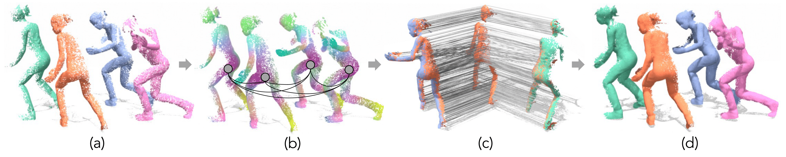

# SyNoRiM: Multiway Non-rigid Point Cloud Registration via Learned Functional Map Synchronization

### [**Paper**](https://arxiv.org/abs/2111.12878) | [**Project Page**](https://cg.cs.tsinghua.edu.cn/people/~huangjh/publication/synorim/)



This repository contains the implementation of the above paper. It is accepted to **T-PAMI (2022)**.
- Authors: [Jiahui Huang](https://cg.cs.tsinghua.edu.cn/people/~huangjh/), [Tolga Birdal](http://tbirdal.me/), [Zan Gojcic](https://zgojcic.github.io/), [Leonidas Guibas](https://geometry.stanford.edu/member/guibas/), [Shi-Min Hu](https://cg.cs.tsinghua.edu.cn/shimin.htm)
    - Contact Jiahui either via email or github issues :)


If you find our code or paper useful, please consider citing
```bibtex
@article{huang2021multiway,
  title={Multiway Non-rigid Point Cloud Registration via Learned Functional Map Synchronization},
  author={Huang, Jiahui and Birdal, Tolga and Gojcic, Zan and Guibas, Leonidas J and Hu, Shi-Min},
  journal={arXiv preprint arXiv:2111.12878},
  year={2021}
}
```

## Implementations

We provide two implementations based on Jittor and Pytorch (the latter is also available on the `public` branch which is also kept up-to-date). 
Please refer to the corresponding folders `jittor/` and `pytorch/` for specific build and running instructions.
